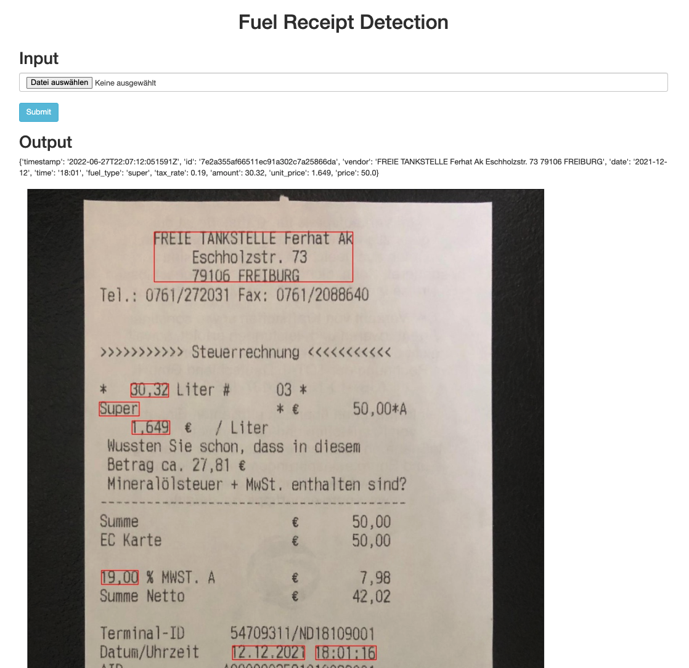

# Fuel Receipt Detection API Documentation

This guide will give you everything you need to start using the Fuel Receipt Detection
API to detect information from fuel receipts. The API is stateless – all requests are
validated against a username and password. It uses a JSON format for output.

We’ll walk through accessing the API, hitting the endpoint programmatically and using the
web interface.

## API Access <a name="access"></a>

Accessing the Fuel Receipt Detection API requires simple authentication with a username
and password.

## Endpoint

### Scan

`POST /api/v1/scan`

Scan a fuel receipt and get the information from the receipt

#### Basic Functionality

When `scan` is hit successfully, the function `scan_receipt.scan_receipt_main`
gets executed which covers the following steps:

1. Detect text in the image using the Google Cloud Vision API<br>
    Docs: https://cloud.google.com/vision/docs/ocr#vision_text_detection-python
2. Extract appropriate information from text using regular expressions
3. Save the scanned image with red boxes drawn around the highlighted information

#### Terminal: Example Request

```bash
URL=https://fuel-receipt-detection.herokuapp.com/api/v1/scan
IMG_PATH=path/to/images/image.jpg  # add correct image path
API_USERNAME=None  # add username
API_PASSWORD=None  # add password

curl -X POST $URL -u $API_USERNAME:$API_PASSWORD -F file=@$IMG_PATH
```

#### Python: Example Request

```python
import requests

url = "https://fuel-receipt-detection.herokuapp.com/api/v1/scan"
img_path = "path/to/images/image.jpg"  # add correct image path
api_username = None  # add username
api_password = None  # add password

response = requests.post(
    url=url,
    files={"file": open(img_path, "rb")},
    auth=(api_username, api_password)
)

print(response.text)
```

#### Success Response

If the request to `scan` was successful, the response will look like the following: 

Code: `200`

```json
{
  "amount": 27.95,
  "date": "2022-01-01",
  "fuel_type": "super",
  "price_incl_tax": 50.00,
  "price_per_unit": 1.789,
  "tax_rate": 0.19,
  "time":"9:41"
}
```

### Possible Errors

| Error code | Response | Description |
| --- | --- | --- |
| 401 | Unauthorized Access | The username and/or password are invalid.

## Web Interface

In addition to programmatic access, fuel receipts can be scanned with a UI that can be
accessed at https://fuel-receipt-detection.herokuapp.com/.


